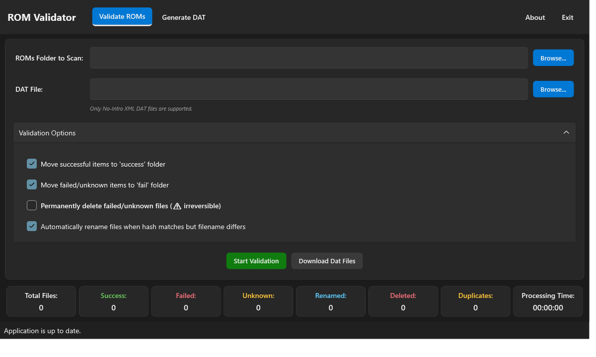
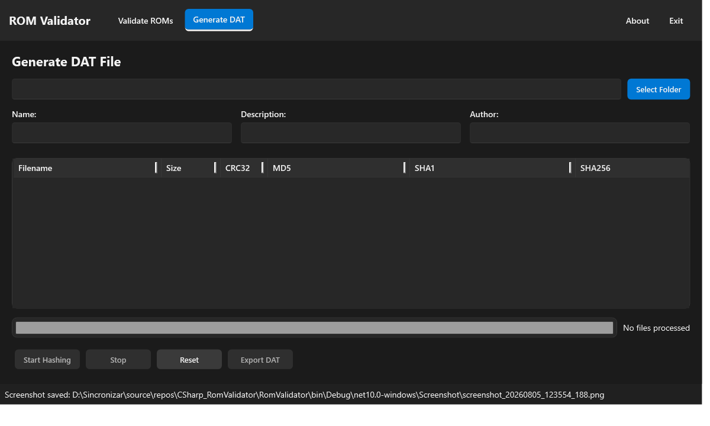

[](https://github.com/drpetersonfernandes/RomValidator/releases)
[](https://github.com/drpetersonfernandes/RomValidator/releases)
[](LICENSE.txt)

# ROM Validator

A Windows desktop application for validating ROM files against DAT files and generating new No-Intro compliant DAT files from your collection.

> **Latest release notes:** see [WhatsNew.md](WhatsNew.md)

## 📸 Screenshots





## Features

- **ROM Validation**: Validate your ROM collection against No-Intro XML DAT files
- **DAT File Generation**: Generate new No-Intro compliant DAT files from your ROM collection
- **Duplicate Detection**: Identify duplicate ROM files in your collection
- **Multiple Hash Support**: CRC32, MD5, SHA-1, and SHA-256 hash verification
- **Archive Support**: Read ROMs directly from `.zip`, `.7z`, and `.rar` archives (SharpSevenZip), with large entries (>256 MB) streamed through a temp file to avoid out-of-memory errors
- **Fluent Dark Theme**: Modern dark UI built on WPF-UI (Windows 11 style)
- **Screenshot Capture**: Press **F8** to save a screenshot of the main window to `%LOCALAPPDATA%\ROM Validator\Screenshot`
- **App Data Button**: the **App Data** button in the top-right corner opens `%LOCALAPPDATA%\ROM Validator` in Explorer — logs (`Logs\`) and screenshots (`Screenshot\`) live there, always writable even when installed under Program Files
- **Version Checking**: Automatic GitHub version checking for updates
- **Robust Error Handling**: Retry-based temp-directory cleanup, binary-format detection for wrongly selected DAT files, and automatic bug reports (Serilog) — user-file errors (corrupt archives, cloud placeholders, locked files) are never reported as application bugs

## Requirements

- **.NET 10.0** or higher
- **Windows 10/11** (x64 or ARM64) — WPF application
- **7z native libraries** (included via SharpSevenZip package)

## Usage

### Validating ROMs
1. Launch the application
2. Navigate to the "Validate ROMs" tab
3. Load a DAT file (No-Intro format, `.dat` or `.xml`)
4. Select your ROM directory or archive
5. Click "Start Validation" to begin
6. Review the results: matched, failed, unknown, renamed, and duplicate files, with live progress stats

### Generating DAT Files
1. Navigate to the "Generate DAT" tab
2. Select your ROM directory
3. Configure output settings (name, description, author)
4. Click "Start Hashing" to compute hashes, then "Export DAT"
5. Save the generated DAT file for use with other ROM management tools

### Tips
- Use **F8** anytime to capture a screenshot of the current window.
- Click **App Data** (top-right, next to About) to open the folder where logs and screenshots are stored.
- DAT files must be No-Intro XML; ZIP archives, binary images, and ClrMamePro/MAME formats are detected and rejected with a clear message.
- If a file is temporarily locked (e.g. still being written), the app retries automatically and cleans up leftover temp folders in the background.

## Dependencies

- **WPF-UI** (4.3.0): Fluent design system and dark theme
- **Serilog** (4.4.0) + Sinks (Debug, File): structured logging and automatic bug reports
- **SharpSevenZip** (2.0.109): 7z/RAR archive support with native win-x64/win-arm64 libraries
- **xUnit** (2.9.3), **Microsoft.NET.Test.Sdk** (18.8.1), **coverlet.collector** (10.0.1): testing

## Tests

The solution includes unit and integration tests (models, services, hash calculation, temp-directory cleanup, serialization). Run them with:

```
dotnet test
```

## Acknowledgments

- No-Intro for the DAT file format specification
- SharpSevenZip for archive support
- WPF-UI for the Fluent design system

## Contributing & Support

* **Donate:** If you find this project useful, consider [supporting the developer](https://www.purelogiccode.com/donate).
* **If you like this project, please give us a star on GitHub! ⭐**

## 📜 License

This project is licensed under the GPLv3 License – see the [LICENSE](LICENSE.txt) file for details.
