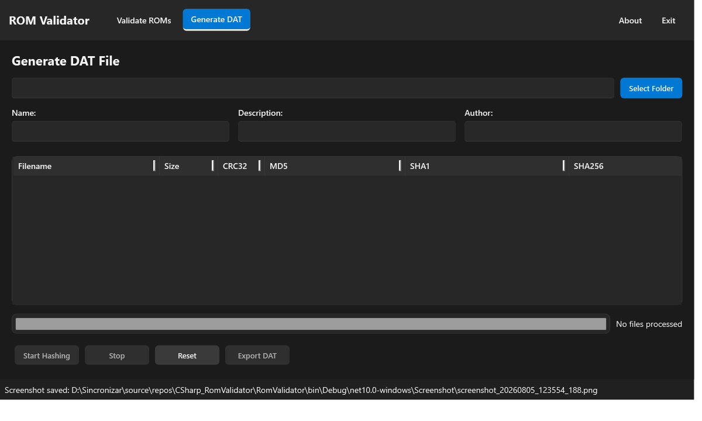

[](https://github.com/purelogiccode/RomValidator/actions/workflows/ci.yml)
[](https://github.com/purelogiccode/RomValidator/actions/workflows/docs.yml)
[](https://github.com/purelogiccode/RomValidator/releases)
[](https://github.com/purelogiccode/RomValidator/releases)
[](https://github.com/purelogiccode/RomValidator/stargazers)
[](https://github.com/purelogiccode/RomValidator/forks)
[](https://github.com/purelogiccode/RomValidator/issues)
[](https://github.com/purelogiccode/RomValidator/commits/master)
[](https://dotnet.microsoft.com/download/dotnet/10.0)
[](https://github.com/purelogiccode/RomValidator/releases)
[](LICENSE.txt)
[](docs/contributing.md)

# ROM Validator

A Windows desktop application for validating ROM files against DAT files and generating new No-Intro compliant DAT files from your collection.

> **Documentation:** <https://purelogiccode.github.io/RomValidator/> &nbsp;|&nbsp; **Release notes:** see [docs/release-notes.md](docs/release-notes.md)

## 📸 Screenshots




## Features

- **ROM Validation**: Validate your ROM collection against No-Intro XML DAT files
- **DAT File Generation**: Generate new No-Intro compliant DAT files from your ROM collection
- **Duplicate Detection**: Identify duplicate ROM files in your collection
- **Multiple Hash Support**: CRC32, MD5, SHA-1, and SHA-256 hash verification
- **Archive Support**: Read ROMs directly from `.zip`, `.7z`, and `.rar` archives (SharpCompress), with the bundled `7za.exe` / `7za_arm64.exe` as a fallback for archives SharpCompress cannot read or create
- **Fluent Dark Theme**: Modern dark UI built on WPF-UI (Windows 11 style)
- **Screenshot Capture**: Press **F8** to save a screenshot of the active window to the `Screenshot\` folder next to the executable (falling back to `%LOCALAPPDATA%\ROM Validator\Screenshot` when the application folder is read-only)
- **App Data Button**: the **App Data** button in the top-right corner opens `%LOCALAPPDATA%\ROM Validator` in Explorer — logs (`Logs\`) and fallback screenshots (`Screenshot\`) live there, always writable even when installed under Program Files
- **Version Checking**: Automatic GitHub version checking at startup, with a prompt to open the release page when an update is available
- **Robust Error Handling**: Retry-based temp-directory cleanup, binary-format detection for wrongly selected DAT files, and automatic bug reports (Serilog) — all Warning, Error, and Fatal events are forwarded to the bug report API

## Requirements

- **Windows 10/11** (x64 or ARM64) — WPF application
- **.NET 10 Desktop Runtime** — the release zip is framework-dependent
- **7-Zip standalone executables** (`7za.exe` for x64, `7za_arm64.exe` for ARM64, 7-Zip 26.03) — included for the archive fallback

## Installation

1. Download the zip for your architecture from the [latest release](https://github.com/purelogiccode/RomValidator/releases/latest):
   - `release_<version>_win-x64.zip`
   - `release_<version>_win-arm64.zip`
2. Extract it to a permanent folder and run `RomValidator.exe`. The application refuses to run directly from a zip archive or a temporary folder.

Each zip contains a single-file `RomValidator.exe` (framework-dependent), the bundled 7-Zip fallback executables, and `LICENSE.txt`, `ReadMe.md` and `WhatsNew.md`.

Full instructions: [Getting Started](docs/getting-started.md).

## Documentation

The complete documentation lives in the [`docs/`](docs) folder and is published to:

- **Documentation site:** <https://purelogiccode.github.io/RomValidator/>
- **GitHub Wiki:** <https://github.com/purelogiccode/RomValidator/wiki>

| Section | Contents |
|:--------|:---------|
| [Getting Started](docs/getting-started.md) | Install, first run, quick start |
| [User Guide](docs/user-guide.md) | Validation, DAT generation, duplicates, archives, data |
| [Reference](docs/reference.md) | Formats, troubleshooting, build, architecture, CI/CD |
| [FAQ](docs/faq.md) | Frequently asked questions |
| [Contributing](docs/contributing.md) | Bugs, features, pull requests |

## Usage

### Validating ROMs
1. Launch the application
2. Navigate to the "Validate ROMs" tab
3. Load a DAT file (No-Intro format, `.dat` or `.xml`)
4. Select your ROM directory or archive
5. Click "Start Validation" to begin
6. Review the results: matched, failed, unknown, renamed, and duplicate files, with live progress stats

### Generating DAT Files
1. Navigate to the "Generate DAT" tab
2. Select your ROM directory
3. Configure output settings (name, description, author)
4. Click "Start Hashing" to compute hashes, then "Export DAT"
5. Save the generated DAT file for use with other ROM management tools

### Tips
- Use **F8** anytime to capture a screenshot of the active window.
- Click **App Data** (top-right, next to About) to open the folder where logs and fallback screenshots are stored.
- DAT files must be No-Intro XML; ZIP archives, binary images, and ClrMamePro/MAME formats are detected and rejected with a clear message.
- If a file is temporarily locked (e.g. still being written), the app retries automatically and cleans up leftover temp folders in the background.

## Dependencies

- **WPF-UI** (4.3.0): Fluent design system and dark theme
- **Serilog** (4.4.0) + Sinks (Debug, File): structured logging and automatic bug reports
- **SharpCompress** (0.50.4): zip/7z/RAR archive reading and zip/7z archive creation
- **7-Zip 26.03** (`7za.exe` / `7za_arm64.exe`): fallback for archive operations SharpCompress cannot perform
- **xUnit** (2.9.3), **Microsoft.NET.Test.Sdk** (18.10.1), **coverlet.collector** (10.1.0): testing

## Tests

The solution includes unit and integration tests (models, services, hash calculation, archive handling, temp-directory cleanup, serialization). Run them with:

```
dotnet test
```

## Continuous Integration

| Workflow | Purpose |
|:---------|:--------|
| [CI](.github/workflows/ci.yml) | Builds and tests every push and pull request |
| [Release](.github/workflows/release.yml) | Publishes the single-file win-x64/win-arm64 zips (with license, readme and what's new) and checksums on `release_*` / `v*` tags |
| [Docs](.github/workflows/docs.yml) | Publishes the documentation site and mirrors `docs/` to the wiki |

See [CI/CD](docs/ci-cd.md) for details.

## What's New

See [WhatsNew.md](WhatsNew.md) for the latest release highlights and [Release Notes](docs/release-notes.md) for the full history.

## Acknowledgments

- No-Intro for the DAT file format specification
- SharpCompress for archive support
- 7-Zip for the standalone fallback executables
- WPF-UI for the Fluent design system

## Contributing & Support

* **Donate:** If you find this project useful, consider [supporting the developer](https://www.purelogiccode.com/donate).
* **If you like this project, please give us a star on GitHub! ⭐**

## 📜 License

This project is licensed under the GPLv3 License – see the [LICENSE](LICENSE.txt) file for details.

Copyright (C) 2026 [Peterson Fernandes](https://github.com/drpetersonfernandes) – [PureLogicCode.com](https://www.purelogiccode.com)
