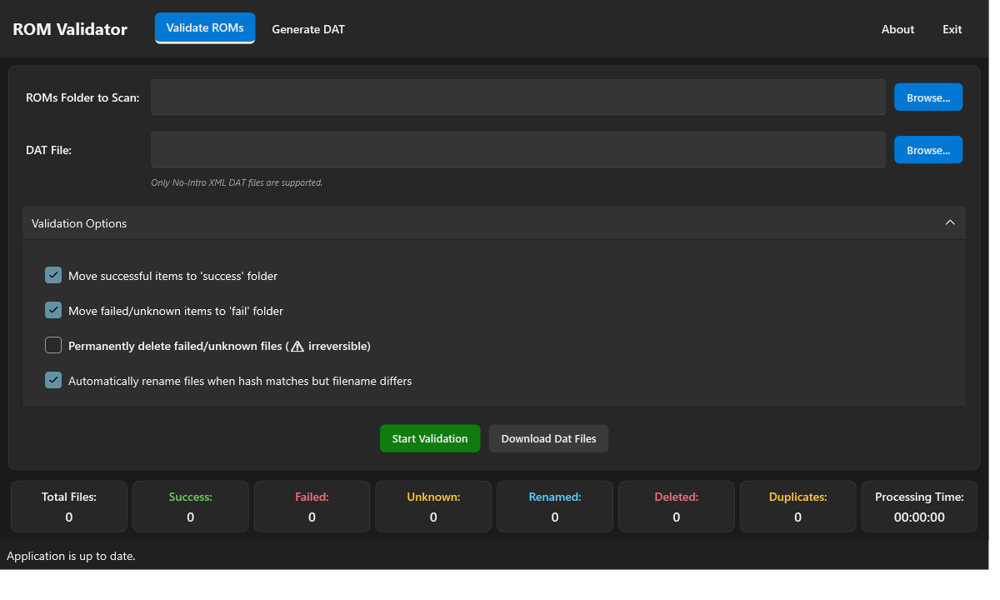

# ROM Validator

A Windows desktop application for validating ROM files against DAT files and generating new
No-Intro compliant DAT files from your collection.

## What you can do

| Task | Where |
|:-----|:------|
| Validate ROMs against a No-Intro DAT file | **Validate ROMs** tab |
| Rename files whose hash matches a DAT entry | **Validate ROMs** tab, "Automatically rename..." |
| Move or delete failed/unknown files | **Validate ROMs** tab, "Move..." / "Permanently delete..." |
| Generate a new DAT file from a folder of ROMs | **Generate DAT** tab |
| Review duplicate ROMs found during generation | Duplicate Files window |
| Capture a screenshot of the active window | Press **F8** anywhere |

## Documentation map

- [Getting Started](getting-started) - install, first run, and quick start
- [User Guide](user-guide) - validating ROMs, generating DAT files, archives, screenshots
- [Reference](reference) - supported formats, troubleshooting, build, architecture, CI/CD
- [FAQ](faq) - frequently asked questions
- [Contributing](contributing) - report bugs, request features, submit changes
- [Release Notes](release-notes) - what changed in each release

## Key features

- **ROM validation** against No-Intro XML DAT files with CRC32, MD5, SHA-1 and SHA-256 checks.
- **DAT generation** from any folder of ROMs, including duplicate detection.
- **Archive support** for `.zip`, `.7z` and `.rar` using SharpCompress, with the bundled
  `7za.exe` / `7za_arm64.exe` (7-Zip 26.03) as a fallback.
- **Safe file operations**: moves go to `_success`, `_fail` and `_duplicate` folders; deletion
  is opt-in and requires confirmation.
- **Automatic update checks** against GitHub releases.
- **Robust diagnostics**: rolling log files, F8 screenshots, and automatic bug reports for
  Warning, Error and Fatal events.

## Project links

- [GitHub repository](https://github.com/purelogiccode/RomValidator)
- [Latest release](https://github.com/purelogiccode/RomValidator/releases/latest)
- [Report an issue](https://github.com/purelogiccode/RomValidator/issues)
- [Official website](http://www.purelogiccode.com)
